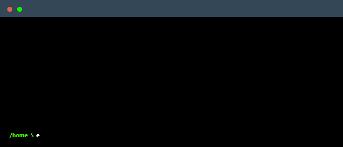

# lolcat: cat but with meows!

 ```
 /\_/\  
( o.o ) 
 > ^ < 
 ```

 cat but with meows! Concatenate file(s) to meows, or read from standard input to meows if no files are specified.

 Written in Rust, because... why not?



 ## Usage

 ```bash
 lolcat [OPTIONS]
 ```

```
Options:
  -f, --files <FILES>  Path to file(s) [default: ]
  -n, --number-lines   Number lines
  -b, --nonblank       Number nonblank lines
  -h, --help           Print help
```

If files are not provided, lolcat reads from stdin.